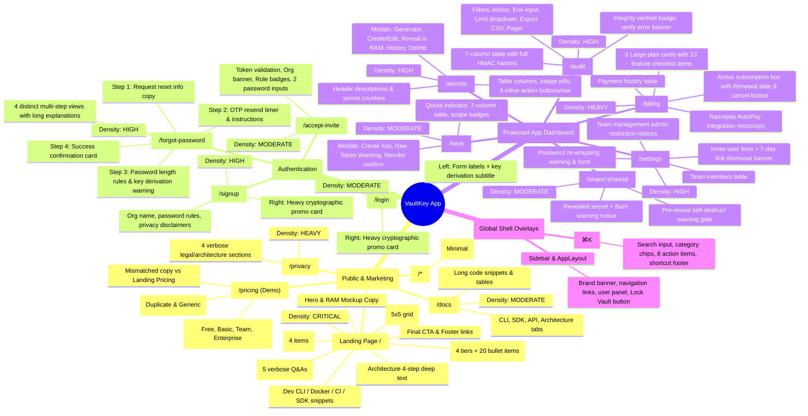

# VaultKey UI: Hardcoded Text Audit & Overcrowding Mindmap

> **Document Purpose**: Complete, page-by-page catalog of every hardcoded string, label, disclaimer, instruction, and microcopy across all VaultKey screens. Includes a cognitive clutter analysis and an actionable **"Make It Minimal"** reduction guide for every view.

---

## 1. Global Screen & Clutter Mindmap

The diagram below maps every screen, its information density level, and the primary causes of cognitive overcrowding.



---

## 2. Text Density Index Across Screens

| Screen / Component | Route / Location | Density Score | Primary Source of Text Bloat |
| :--- | :--- | :---: | :--- |
| **Landing Page** | `/` | 🔴 **Critical (95%)** | 8 long marketing sections, repeated cryptographic acronyms, 5 long FAQs, 20 pricing bullets |
| **Billing Page** | `/billing` | 🔴 **Severe (85%)** | 13 feature checkmarks, verbose card descriptions, duplicate plan info, AutoPay notices |
| **Forgot / Reset Flow** | `/forgot-password` | 🟡 **High (75%)** | 4 multi-step screens with redundant instructional text ("If your email exists...", "Make sure to remember...") |
| **Settings Page** | `/settings` | 🟡 **High (70%)** | Verbose warnings ("re-derives Argon2id key material..."), dual password inputs, one-time link copy instructions |
| **Secrets Page & Modals** | `/secrets` | 🟡 **High (70%)** | 4 action buttons per row, lengthy modal titles, helper disclaimers on immutability and RAM decryption |
| **Audit Ledger** | `/audit` | 🟡 **High (65%)** | Verbose page description, multi-filter bar labels, pagination offset strings, full cryptographic HMAC hashes |
| **Signup & Login** | `/signup`, `/login` | 🟡 **Moderate (60%)** | Right-hand hero visual with 4 technical pills + quote, redundant subtitles under clear headers |
| **API Keys** | `/keys` | 🟢 **Moderate (50%)** | 7-column table with status/scope badges, raw token dismissal warning |
| **Share Page** | `/share/:id` | 🟢 **Moderate (45%)** | 3 separate warning paragraphs explaining burn-on-read |
| **Docs Page** | `/docs` | 🟢 **Balanced (40%)** | Code-focused, structured tabs |
| **404 Page** | `/*` | 🟢 **Clean (20%)** | Minimal header, short error copy, 2 navigation buttons |

---

## 3. Page-by-Page Audit & Overcrowding Breakdown

---

### Page 1: Landing Page (`/`)
**Files**: `pages/LandingPage.tsx`, `components/landing/*`  
**Current Text Density**: 🔴 **Critical (120+ unique copy strings)**

#### A. Hardcoded Text Inventory

##### 1. Sticky Navigation (`LandingHeader.tsx`)
- Brand: `"VaultKey"`
- Links: `"Architecture"`, `"CLI & Workflows"`, `"Comparison"`, `"Pricing"`, `"Docs"`
- Actions: `"Sign in"`, `"Deploy VaultKey"`

##### 2. Hero Section (`HeroSection.tsx` & `VaultKeyHeroVisual.tsx`)
- Headline: `"Secrets in runtime memory. Never on disk."`
- Subtitle: `"A single-binary secrets engine for engineering teams. Inject encrypted credentials directly into process memory via Argon2id and AES-256-GCM zero-knowledge encryption."`
- CTAs: `"Get Started Free"`, `"View Documentation"`
- Stats / Metric Pills:
  - `"0 ms"` — `"Disk exposure (RAM-only)"`
  - `"256-bit"` — `"AES-GCM Encryption"`
  - `"100%"` — `"Single-binary engine"`
- Terminal Mockup Window Copy:
  - Window header: `"vaultkey-runtime — bash"`
  - Prompt: `"$ vaultkey run --env=production -- node server.js"`
  - Execution log: `"[00:00.02] ⚡ Argon2id key derivation (64MB RAM) ... OK"`
  - Execution log: `"[00:00.04] 🔒 14 secrets injected into RAM via AES-256-GCM"`
  - Execution log: `"[00:00.07] 🛡️ Zero plaintext on disk · RAM zeroed on exit"`
  - Execution log: `"[00:00.09] 📜 Audit ledger signed: HMAC-SHA256 (7a9e...3d2f)"`
  - Status footer: `"Server listening on :8080 (PID 4821)"`, badge: `"RAM PROTECTED"`
- Floating Badges:
  - Badge 1: `"Zero-Disk RAM Lock"`, `"No plaintext touches storage"`
  - Badge 2: `"Argon2id + AES-256-GCM"`, `"Memory-hard cryptographic core"`

##### 3. Trust Proof Bar (`TrustProofBar.tsx`)
- Item 1: `"Cipher & Derivation"` → `"AES-256-GCM · Argon2id"` → `"64MB memory cost, zero-knowledge client derivation."`
- Item 2: `"Deployment Binary"` → `"Go Static (~18MB)"` → `"Embedded SQLite in WAL mode. Zero external dependencies."`
- Item 3: `"Injection Model"` → `"RAM-Only Pipeline"` → `"Direct process execution via execve. Zero plaintext on disk."`
- Item 4: `"Ledger Integrity"` → `"HMAC-SHA256 Chain"` → `"Tamper-evident verification sequence for audit logs."`

##### 4. Security Architecture (`ArchitectureSection.tsx`)
- Tag: `"SECURITY ARCHITECTURE"`
- Headline: `"Memory-only pipeline. Zero plaintext on disk."`
- Paragraph: `"Most secret leaks occur because dot-env files sit unencrypted on developer laptops or in CI cache disks. VaultKey keeps secrets strictly in RAM during execution and securely encrypted at rest."`
- 4 Pipeline Step Cards:
  - Step 01 (`DERIVATION`): `"Client-Side KDF"` → `"Master secret is derived via Argon2id (m=64MB, t=3, p=4) purely on the client. The master key never leaves local memory."`
  - Step 02 (`RAM BUFFER`): `"Locked Memory Page"` → `"Decrypted secrets reside in locked RAM pages (mlock) protected against swap paging, core dumps, and inter-process reads."`
  - Step 03 (`INJECTION`): `"Process Execve"` → `"VaultKey launches the target child process directly, passing decrypted environment variables into its memory space."`
  - Step 04 (`ZEROIZATION`): `"Atomic Scrub"` → `"The instant the child process terminates, all decrypted memory buffers are wiped with zeroes and the vault re-locks."`
- Architecture Spec Matrix:
  - `"Storage Engine"` → `"Embedded SQLite in WAL mode"`
  - `"Cipher Suite"` → `"AES-256-GCM + CSPRNG 12B nonces"`
  - `"Audit Verification"` → `"HMAC-SHA256 chained hash ledger"`
  - `"Distribution"` → `"Single static Go binary (zero deps)"`

##### 5. CLI & Workflows (`DevExperienceSection.tsx` & `DevWorkflowTabs.tsx`)
- Tag: `"CLI & WORKFLOWS"`
- Headline: `"From local dev to production in one command."`
- Paragraph: `"No cumbersome SDK refactors required. With vaultkey run, your existing scripts, Dockerfiles, and CI jobs receive secrets directly in process memory at boot time."`
- Tabs: `"CLI"`, `"DOCKER"`, `"CI"`, `"SDK"`
- Tab Titles & Code Snippets:
  - CLI: `"Local CLI Injection"` → Note: `"NOTE: Zero disk writes. Decrypted environment variables are zeroed upon process exit."`
  - Docker: `"Docker Runtimes"` → Note: `"NOTE: Eliminate plaintext secrets in container images or volume mounts."`
  - CI: `"CI / CD Workflows"` → Note: `"NOTE: Avoid synchronizing and rotating static secrets across multiple repository settings."`
  - SDK: `"Programmatic API"` → Note: `"NOTE: Designed for microservices requiring runtime credential polling and automated rotation."`

##### 6. Tooling Comparison (`WhyNotEnvSection.tsx` & `ComparisonTable.tsx`)
- Tag: `"TOOLING COMPARISON"`
- Headline: `"Built for teams that outgrew .env but don't need cluster ops."`
- Paragraph: `"Plain .env files leak secrets to disk and git history. Enterprise tools like HashiCorp Vault require dedicated cluster infrastructure. VaultKey delivers zero-knowledge encryption and RAM injection with zero operational overhead."`
- Table Headers: `"Capability"`, `"VaultKey"`, `"HashiCorp Vault"`, `"AWS / GCP Secrets"`, `"Plain .env Files"`
- 5 Comparison Rows (25 matrix cells with lengthy text strings comparing footprint, dev experience, disk-free status, audit, and cost).

##### 7. Pricing Section (`PricingSection.tsx` & `PricingModule`)
- Tag: `"PRICING & PLANS"`
- Headline: `"Self-host for free. Upgrade when your team grows."`
- Subtitle: `"VaultKey is open-core. Run it yourself with zero telemetry, or let us manage uptime, team RBAC, and backups."`
- Toggle Labels: `"Monthly"`, `"Annual"`, `"Pay annually (save 20%)"`
- 4 Full Tiers:
  - Developer (OSS): `$0/mo`, `"Unlimited local seats"`, `"Self-hosted zero-telemetry single binary engine for local and VPS environments."`, 5 feature items.
  - Developer Pro: `$9/mo ($90/yr)`, `"Up to 3 workstations"`, `"Encrypted cloud backup and automated sync across dev workstations and CI pipelines."`, 5 feature items.
  - Team Cloud (Recommended): `$29/mo ($290/yr)`, `"Up to 25 engineers"`, `"Managed cloud instance for engineering teams with centralized RBAC and audit ledger."`, 5 feature items.
  - Enterprise: `$199/mo ($1990/yr)`, `"Unlimited team members"`, `"Dedicated single-tenant infrastructure, custom SLA, and SOC2 / HIPAA readiness."`, 5 feature items.
- Button: `"Get Started"`

##### 8. Frequently Asked Questions (`FaqSection.tsx`)
- Tag: `"FAQ"`
- Headline: `"Frequently Asked Questions"`
- Subtitle: `"Cryptographic guarantees, memory lifecycle, and deployment questions answered directly."`
- 5 Questions & Extensive Paragraph Answers:
  1. *"How does VaultKey prevent secrets from ever touching the disk?"* (45 words)
  2. *"Can VaultKey be self-hosted in an air-gapped environment?"* (35 words)
  3. *"How is the master encryption key derived and protected?"* (38 words)
  4. *"How does the tamper-evident HMAC audit ledger work?"* (35 words)
  5. *"How do CI/CD pipelines authenticate without storing static keys?"* (33 words)

##### 9. Final CTA & Install Banner (`FinalCtaSection.tsx`)
- Headline: `"Stop committing secrets to disk."`
- Description: `"Install the CLI on your workstation or server in seconds. Zero telemetry, zero external dependencies."`
- Command: `"$ curl -sSL https://vaultkey.sh/install | sh"`
- Copy Button: `"COPY"` / `"COPIED"`
- Buttons: `"Create Vault"`, `"GitHub Repository"`, `"Documentation"`

##### 10. Footer (`LandingFooter.tsx`)
- Brand statement: `"Secure secrets for modern engineering teams. Keep credentials out of code with zero-trust encryption."`
- Link groups:
  - Product: `"Secrets Vault"`, `"Machine Access Keys"`, `"Audit Ledger"`, `"Pricing & Tiers"`
  - Developers: `"CLI Setup"`, `"REST API Reference"`, `"Cryptographic Architecture"`, `"GitHub Repository"`
  - Governance: `"Privacy Policy"`, `"Responsible Disclosure"`, `"Contact Support"`
- Copyright: `"© 2026 VaultKey. All rights reserved."`
- Tagline: `"Engineered for zero-knowledge security."`

#### B. Cognitive Overcrowding Mindmap (Landing Page)
```
Landing Page Overcrowding
├── Repetitive Tech Jargon: "Argon2id", "AES-256-GCM", "RAM-only", "zero-disk" repeated in 7 different sections
├── Double-describing Features: Trust Proof Bar (4 items) repeats what Architecture Section (4 steps) says
├── Explanatory "NOTE:" lines beneath code snippets that restate the obvious
├── Massive 20-bullet feature checklist in pricing cards
└── Full paragraph answers in FAQ creating walls of prose
```

#### C. "Make It Minimal" Redesign Recommendations
1. **Cut the Trust Proof Bar completely** or consolidate it into 3 clean metric badges under the Hero.
2. **Shorten Hero Subtitle** from 26 words down to 11:
   - *Before*: `"A single-binary secrets engine for engineering teams. Inject encrypted credentials directly into process memory via Argon2id and AES-256-GCM zero-knowledge encryption."`
   - *After*: `"Inject encrypted secrets directly into process memory. Zero plaintext on disk."`
3. **Remove "NOTE:" footers** in the DevWorkflow tabs—the code speaks for itself.
4. **Condense FAQ Answers** to 1 punchy sentence each (or hide under progressive disclosure).
5. **Trim Pricing Feature Lists**: Keep 3 high-impact bullets per plan instead of 5 detailed lines.

---

### Page 2: Login Screen (`/login`)
**Files**: `pages/Login.tsx`, `components/auth/AuthSplitLayout.tsx`, `components/auth/AuthHeroVisual.tsx`  
**Current Text Density**: 🟡 **Moderate (35 strings, visual clutter on right pane)**

#### A. Hardcoded Text Inventory

##### 1. Left Form Column (`Login.tsx`, `AuthSplitLayout.tsx`)
- Brand Tag: `"VaultKey"`, `"ZERO-TRUST ENGINE"`
- Header: `"Sign in to your vault"`
- Subtitle: `"Enter your credentials to derive your team master key in memory"`
- Field 1 Label: `"Work Email"`
- Field 1 Placeholder: `"engineer@company.com"`
- Field 2 Label: `"Master Password"`
- Field 2 Link: `"Forgot password?"`
- Field 2 Placeholder: `"••••••••••••"`
- Submit Button: `"Log in"` (Active: `"Deriving Key..."`)
- Error Fallback: `"Authentication failed. Verify your credentials."`
- Footer Copy: `"Don't have an account?"` → Link: `"Create your vault"`

##### 2. Right Showcase Pane (`AuthHeroVisual.tsx`)
- Top Badge: `"ZERO-DISK RAM DERIVATION"`
- Center Lock Graphic: Dashed neon border + lock icon
- 4 Feature Pills:
  - `"Argon2id · 64MB RAM"`
  - `"AES-256-GCM Envelope"`
  - `"Chained HMAC Ledger"`
  - `"Immediate RAM Zeroing"`
- Bottom Quote: `"“Your secrets never touch disk. Derived fresh in RAM on unlock, zeroed on lock.”"`
- Quote Subtitle: `"Cryptographic zero-knowledge infrastructure for engineering teams."`

#### B. Cognitive Overcrowding Mindmap (Login)
```
Login Screen
├── Redundant Key Derivation Copy: Subtitle describes key derivation, button says "Deriving Key...", right pane has 4 derivation pills
├── Right Pane Distraction: Split screen displays 6 separate cryptographic claims beside a standard 2-field login form
└── Field Labels: Master password placeholder with 12 dots is unnecessary visual noise
```

#### C. "Make It Minimal" Redesign Recommendations
- **Subtitle**: Change `"Enter your credentials to derive your team master key in memory"` → `"Welcome back."` or drop subtitle completely.
- **Button**: Keep label as `"Sign In"` (Loading: `"Signing In..."`).
- **Right Hero Visual**: Drop the 4 technical pills and bottom quote. Replace with a subtle minimalist graphic or a clean terminal snippet.

---

### Page 3: Signup Screen (`/signup`)
**Files**: `pages/Signup.tsx`, `components/auth/AuthSplitLayout.tsx`, `components/auth/AuthHeroVisual.tsx`  
**Current Text Density**: 🟡 **High (40+ strings)**

#### A. Hardcoded Text Inventory
- Brand: `"VaultKey"`, `"ZERO-TRUST ENGINE"`
- Header: `"Create your account"`
- Subtitle: `"Provision an isolated zero-trust encrypted vault for your engineering team"`
- Field 1 Label: `"Work Email"` | Placeholder: `"engineer@company.com"`
- Field 2 Label: `"Organization / Team Name"` | Placeholder: `"e.g. Acme Cloud"`
- Field 3 Label: `"Master Password"` | Placeholder: `"••••••••••••"`
- Field 4 Label: `"Confirm Password"` | Placeholder: `"••••••••••••"`
- Submit CTA: `"Create your account"` (Active: `"Initializing Vault..."`)
- Legal Disclaimer: `"By clicking “Create your account”, you agree to our Privacy Policy and security terms."`
- Footer Link: `"Already have an account? Log in"`
- Error Messages: `"Passwords do not match."`, `"Registration failed."`
- Right Pane: Identical copy to Login (`AuthHeroVisual.tsx`).

#### B. "Make It Minimal" Redesign Recommendations
- **Subtitle**: Change `"Provision an isolated zero-trust encrypted vault for your engineering team"` → `"Set up your team vault."`
- **Password Confirm**: Remove the duplicate confirm password field and use an eye-toggle icon to verify typing (standard in modern minimalist auth).
- **Disclaimer**: Simplify to `"By signing up, you agree to our Privacy Policy."`

---

### Page 4: Forgot & Reset Password Flow (`/forgot-password`, `/reset-password`)
**Files**: `pages/ForgotPasswordPage.tsx`, `components/auth/*`  
**Current Text Density**: 🟡 **High (4 sequential views with heavy instructional text)**

#### A. Hardcoded Text Inventory by Step

##### Step 1: Request Reset View (`RequestResetView.tsx`, `AuthCardLayout.tsx`)
- Navigation: `"Back"`, `"Close"`
- Header: `"Forgot your password?"`
- Subtitle: `"Enter the email address associated with your vault and we'll send you a 6-digit code to reset your password."`
- Field Label: `"Work Email"` | Placeholder: `"name@company.com"`
- Helper Note: `"If your email address exists in our database, you will receive a 6-digit verification code to securely reset your master password."`
- Button: `"Send code"` (Loading: `"Sending..."`)
- Shortcut Hint: `KeyboardHint.tsx`: `"Press ↵ to continue"`
- Error fallback: `"Failed to request reset code."`

##### Step 2: OTP Verification View (`VerifyOtpView.tsx`, `OtpSegmentedInput.tsx`)
- Header: `"Password reset"`
- Subtitle: `"We sent a 6-digit verification code to {email}"`
- Resend Copy: `"Didn't receive the email?"`
- Resend Action: `"Click to resend"` (Cooldown: `"Resend in {cooldown}s"`)
- Submit Button: `"Submit"` (Loading: `"Verifying..."`)
- Shortcut Hint: `"Press ↵ to continue"`
- Errors: `"Invalid verification code."`, `"Failed to resend code."`

##### Step 3: Set New Password View (`SetNewPasswordView.tsx`)
- Header: `"Set new password"`
- Subtitle: `"It must be at least 8 characters."`
- Field 1: `"New Master Password"` | Placeholder: `"••••••••••••"`
- Field 2: `"Confirm Password"` | Placeholder: `"••••••••••••"`
- Warning Notice: `"Make sure to remember your new password. VaultKey uses client-derived encryption keys to keep your secrets private."`
- Submit Button: `"Reset password"` (Loading: `"Updating..."`)
- Shortcut Hint: `"Press ↵ to continue"`
- Errors: `"Passwords do not match."`, `"Failed to reset password."`

##### Step 4: Success View (`ResetSuccessView.tsx`)
- Header: `"All done"`
- Subtitle: `"Your password has been reset so now you can log in to your account."`
- Button: `"Log in"`

#### B. Cognitive Overcrowding Mindmap (Forgot Password)
```
Forgot Password Flow
├── Redundant Explanations:
│   ├── Step 1 has subtitle AND a 22-word paragraph saying the exact same thing
│   └── Step 3 has subtitle ("Must be at least 8 chars") AND a 17-word warning notice
└── Redundant Nav & Keyboard Hints: "Back", "Close", and "Press ↵ to continue" repeated on every single card
```

#### C. "Make It Minimal" Redesign Recommendations
- **Step 1**: Delete the 22-word helper note (`"If your email address exists in our database..."`). The subtitle is already clear.
- **Step 3**: Delete the warning note (`"Make sure to remember your new password..."`).
- **Remove Keyboard Hint**: Modern users naturally press Enter to submit forms.

---

### Page 5: Accept Invitation (`/accept-invite`)
**Files**: `pages/AcceptInvitePage.tsx`  
**Current Text Density**: 🟡 **Moderate (28 strings)**

#### A. Hardcoded Text Inventory
- Header: `"Accept Invitation"`
- Subtitle: `"Set your password to derive your zero-knowledge vault key."`
- Loading State: `"Verifying invitation token..."`
- Error Banner: `"Invitation Error"`, `"Missing invite token. Please verify your invitation link."`, `"This invitation is invalid or has expired."`
- Invitation Context Box:
  - Label: `"ORGANIZATION"`
  - Account info: `"Account: {invite.email}"`
  - Role pill: `"{invite.role}"` (read/write/admin)
- Fields:
  - `"Choose Password"` | Placeholder: `"At least 8 characters"`
  - `"Confirm Password"` | Placeholder: `"Re-enter your password"`
- Submit CTA: `"Activate & Enter Vault"` (Loading: `"Activating Key..."`)
- Bottom Link: `"Already have an account? Sign in"`
- Toast: `"Welcome to {org_name}! Your vault key is activated."`

#### B. "Make It Minimal" Redesign Recommendations
- **Subtitle**: Change `"Set your password to derive your zero-knowledge vault key."` → `"Create your password to join."`
- **Button**: Change `"Activate & Enter Vault"` → `"Join Organization"`

---

### Page 6: Secrets Management Dashboard (`/secrets`)
**Files**: `pages/SecretsPage.tsx`, `components/SecretsHeaderBar.tsx`, `components/SecretsTable.tsx`, `components/SecretsModals.tsx`, `CreateSecretModal.tsx`, `RevealSecretModal.tsx`, `SecretVersionHistoryModal.tsx`, `SecretGeneratorModal.tsx`, `DeleteSecretDialog.tsx`  
**Current Text Density**: 🟡 **High (60+ strings across table and 5 modals)**

#### A. Hardcoded Text Inventory

##### 1. Page Header & Environment Toolbar (`SecretsHeaderBar.tsx`)
- Breadcrumb: `"VAULT SECRETS"`
- Title: `"Secrets"`
- Description: `"Zero-trust end-to-end encrypted under team master key (AES-256-GCM)."`
- Badge: `"{secretCount} secret(s) in {project}"`
- Actions: `"Generator"`, `"New Secret"`
- Search Input Placeholder: `"Search secrets... (⌘K for command palette)"`
- Environment Select: `"Environment:"`

##### 2. Secrets Table (`SecretsTable.tsx`)
- Table Columns: `"KEY NAME"`, `"ENVIRONMENT"`, `"VERSION"`, `"LAST UPDATED"`, `"ACTIONS"`
- Dummy Secret Mask: `"••••••••••••••••"`
- Row Actions:
  - `"Reveal"` (Pending: `"Decrypting..."`)
  - `"History"`
  - `"Edit"`
  - Trash Icon (Delete)
- Empty Search State:
  - Title: `"No secrets match "{search}""`
  - Description: `"Try a different search term or select another environment."`
  - Button: `"Clear search"`
- Empty Environment State:
  - Title: `"No secrets in "{project}" yet"`
  - Description: `"Create your first encrypted secret for this environment. Encrypted under team master key before storage."`
  - Button: `"Create First Secret"`

##### 3. Create / Edit Secret Modal (`CreateSecretModal.tsx`)
- Modal Title: `"Create Secret"` / `"Edit Secret Value"`
- Target Subtitle: `"Target Environment: {project}"`
- Header Action: `"Generator"`
- Field 1: `"Secret Name"` | Placeholder: `"DATABASE_URL / STRIPE_SECRET_KEY"`
- Immutability Helper: `"Secret names are immutable; saving will create an append-only new version."`
- Field 2: `"Secret Value"` | Placeholder: `"Enter or paste secret payload..."`
- Buttons: `"Cancel"`, `"Save & Encrypt"` / `"Save New Version"` (Loading: `"Encrypting..."`)

##### 4. Reveal Secret Modal (`RevealSecretModal.tsx`)
- Badge: `"DECRYPTED"`
- Warning Note: `"Decrypted temporarily in client RAM"`
- 1-Time Share Box Header: `"Self-Destructing 1-Time Link (Single View):"`
- Actions: `"1-Time Link"` (Loading: `"Creating..."`), `"Copy Value"` / `"Copied"`, `"Close"`

##### 5. Version History & Rollback Modal (`SecretVersionHistoryModal.tsx`)
- Header: `"Version History & Rollback"`
- Subtitle: `"Key: {secretKey} (Active: v{currentVersion})"`
- Loading: `"Loading versions..."`
- Empty State: `"No previous version history recorded yet."`
- Row Badge: `"CURRENT"`
- Action: `"Restore v{version}"`
- Rollback Confirmation Dialog:
  - Title: `"Rollback {secretKey}?"`
  - Message: `"The active secret value will be rolled back to snapshot v{target}. An immutable rollback entry will be appended to the audit ledger."`
  - Confirm: `"Confirm Rollback"`

##### 6. Secret Generator Modal (`SecretGeneratorModal.tsx`)
- Title: `"High-Entropy Generator"`
- Subtitle: `"Cryptographically random client-side generation"`
- Sliders & Checkboxes:
  - `"Length"` → `"{length} characters"`
  - `"A–Z (Upper)"`, `"a–z (Lower)"`, `"0–9 (Numbers)"`, `"Symbols (!@#$)"`
- Actions: `"Regenerate"`, `"Copy"` / `"Copied"`, `"Use Secret"`

##### 7. Delete Secret Dialog (`DeleteSecretDialog.tsx`, `ConfirmDialog.tsx`)
- Title: `"Permanently delete secret?"`
- Message: `"This permanently destroys secret "{key}" from environment "{project}". The deletion is irreversibly logged into the cryptographic audit ledger."`
- Typed Confirmation Label: `"Type {key} to confirm"`
- Buttons: `"Cancel"`, `"Delete Secret"`

#### B. Cognitive Overcrowding Mindmap (Secrets Dashboard)
```
Secrets Dashboard
├── Header: 12-word cryptographic description under the word "Secrets"
├── Table Row Actions: 4 explicit text buttons per row ("Reveal", "History", "Edit", "Trash") cluttering table width
├── Search Placeholder: Long string containing "Search secrets... (⌘K for command palette)"
└── Modal Warnings: Every dialog repeats audit ledger / RAM disclaimers
```

#### C. "Make It Minimal" Redesign Recommendations
- **Table Row Actions**: Convert `"History"`, `"Edit"`, and `"Reveal"` into clean icon buttons with subtle hover tooltips. This saves ~180px of horizontal table space per row.
- **Header Description**: Drop `"Zero-trust end-to-end encrypted under team master key (AES-256-GCM)."` — this is already known.
- **Search Bar**: Simplify placeholder to `"Filter secrets..."`.

---

### Page 7: Machine Access / API Keys (`/keys`)
**Files**: `pages/ApiKeysPage.tsx`, `CreateApiKeyModal.tsx`, `TokenCreatedModal.tsx`  
**Current Text Density**: 🟢 **Moderate (32 strings)**

#### A. Hardcoded Text Inventory
- Breadcrumb: `"MACHINE ACCESS"`
- Title: `"API Keys"`
- Description: `"Scoped credentials for CLI, GitHub Actions CI/CD pipelines, and SDK integrations."`
- Quota Badge: `"Pro Plan: Unlimited"` / `"Quota: {count} / 2 active tokens"`
- Top Action: `"Create API Key"`
- Table Columns: `"KEY LABEL"`, `"TOKEN PREFIX"`, `"SCOPE"`, `"LAST USED"`, `"CREATED"`, `"STATUS"`, `"ACTION"`
- Status Badges: `"Active"`, `"Revoked"`
- Scope Badges: `"read"`, `"write"`, `"admin"`
- Table Empty State: `"No machine access tokens generated yet."`
- Row Action: `"Revoke"`
- Generate Modal (`CreateApiKeyModal.tsx`):
  - Title: `"Generate Scoped API Key"`
  - Label: `"Key Label / Application Name"` | Placeholder: `"e.g. GitHub Actions CI / Prod SDK"`
  - Select: `"Permissions Scope"`:
    - `"Read Only (Fetch Secrets)"`
    - `"Read & Write (Manage Secrets)"`
    - `"Full Admin (Org & Key Management)"`
  - Actions: `"Cancel"`, `"Generate Key"` (Loading: `"Generating..."`)
- Token Created Modal (`TokenCreatedModal.tsx`):
  - Title: `"API Key Created"`
  - Subtitle: `"This token will only be shown once. Store it in your CI/CD environment or secret manager before closing."`
  - Warning: `"After dismissal, this raw token can never be retrieved from the server again."`
  - Actions: `"Copy Token"` / `"Copied to Clipboard"`, `"Done"`
- Revoke Dialog:
  - Title: `"Revoke API key?"`
  - Message: `"Any automated workflow, CI/CD pipeline, or CLI session using "{name}" will immediately lose access."`
  - Confirm: `"Revoke Key"`

#### B. "Make It Minimal" Redesign Recommendations
- **Description**: Shorten description from 12 words to 6: `"Scoped machine tokens for automation."`
- **Table Columns**: Drop `"TOKEN PREFIX"` (or merge with `"KEY LABEL"`), drop `"CREATED"` date to leave room for `"LAST USED"`.

---

### Page 8: Audit Ledger & Observability (`/audit`)
**Files**: `pages/AuditPage.tsx`, `components/AuditPaginationBar.tsx`  
**Current Text Density**: 🟡 **High (45 strings, table width overflow)**

#### A. Hardcoded Text Inventory
- Breadcrumb: `"SECURITY OBSERVABILITY"`
- Title: `"Audit Ledger"`
- Description: `"Append-only cryptographic HMAC-SHA256 chained audit entries guarantee immutable log integrity."`
- Badge: `"HMAC-SHA256 Chained"`
- Chain Verification Badges:
  - Valid: `"Ledger Integrity Verified"`
  - Tampered: `"Tamper Detected"`
  - Checking: `"Verifying Chain..."`
- Error Banner: `"Verification request failed: {verifyError}"` → Action: `"Retry"`
- Filter Toolbar (`AuditPaginationBar.tsx`):
  - Actions Select: `"All Actions"`, `"READ"`, `"WRITE"`, `"DELETE"`, `"ROLLBACK"`, `"LOCK"`
  - Project Filter Placeholder: `"Filter by environment..."`
  - Row Limit Select: `"25 rows"`, `"50 rows"`, `"100 rows"`, `"200 rows"`
  - Export Action: `"Export CSV"`
  - Pager String: `"Showing {rowCount} event(s) (offset {offset})"`
  - Pager Buttons: `"Previous"`, `"Next"`
- Table Columns: `"ACTION"`, `"SECRET KEY"`, `"ENVIRONMENT"`, `"ACTOR"`, `"IP ADDRESS"`, `"TIMESTAMP"`, `"HMAC SIGNATURE"`
- Table Empty State: `"No matching audit entries found."`

#### B. Cognitive Overcrowding Mindmap (Audit Ledger)
```
Audit Ledger
├── Header: 12-word description explaining HMAC-SHA256 chained logs (which is also written in the badge right next to it)
├── HMAC Column: Full 64-char hexadecimal hashes displaying in table cells
├── Pager Copy: Verbose "Showing 50 event(s) (offset 0)" string
└── Dual Environment & Action Filters taking up entire horizontal row
```

#### C. "Make It Minimal" Redesign Recommendations
- **Description**: Drop the lengthy description under the title.
- **HMAC Column**: Show a short 8-character prefix (e.g., `7a9e…3d2f`) with a hover tooltip for the full hash.
- **Pager**: Change `"Showing 50 event(s) (offset 0)"` → `"1–50 of {total}"`.

---

### Page 9: Billing & Plans (`/billing`)
**Files**: `pages/BillingPage.tsx`, `components/CancelSubscriptionButton.tsx`, `components/RazorpayCheckoutButton.tsx`, `components/PaymentHistoryTable.tsx`  
**Current Text Density**: 🔴 **Severe (75+ strings, large card feature lists)**

#### A. Hardcoded Text Inventory
- Breadcrumb: `"BILLING & TIERS"`
- Title: `"Team Plans & Subscriptions"`
- Description: `"Zero-trust secret management with team isolation and Razorpay AutoPay recurring billing."`
- Active Subscription Card:
  - Header: `"Active Subscription"` | Status: `"{subStatus}"`
  - Subtitle: `"Subscription ID: {org.subscription_id}"`, `"Renews: {date}"`
  - Action: `"Cancel Auto-Renewal"`
- Cancel Dialog:
  - Title: `"Cancel auto-renewal?"`
  - Message: `"Your Pro Team plan stays active until the end of the current billing period, then reverts to the Free tier."`
  - Confirm: `"Cancel Renewal"`
- Plan 1: Free Starter
  - Headline: `"Free Starter"`, Badge: `"Active"`
  - Price: `"$0 / forever"`
  - Subtitle: `"For individual engineers & micro projects"`
  - 4 Features:
    - `"✓ Up to 25 encrypted secrets"`
    - `"✓ 2 scoped machine access keys"`
    - `"✓ Argon2id + AES-256-GCM encryption"`
    - `"✓ 7-day HMAC audit ledger"`
  - Button: `"Active Plan"` / `"Free Tier"`
- Plan 2: Pro Team
  - Headline: `"Pro Team"`, Badge: `"Active"`
  - Price: `"₹1,499 ($19) / mo"`
  - Subtitle: `"Auto-renewing monthly subscription via UPI / Card"`
  - 5 Features:
    - `"✓ Unlimited encrypted secrets"`
    - `"✓ Unlimited machine access keys"`
    - `"✓ RBAC Team Role Permissions"`
    - `"✓ 90-day HMAC audit ledger history"`
    - `"✓ Priority technical support"`
  - Action: `"Subscribe ₹1,499/mo"` (Loading: `"Setting up AutoPay..."`)
- Plan 3: Enterprise
  - Headline: `"Enterprise"`, Badge: `"Active"`
  - Price: `"Custom"`
  - Subtitle: `"Dedicated infrastructure & custom governance"`
  - 4 Features:
    - `"✓ Dedicated isolated VPS instance"`
    - `"✓ Custom domain SSL termination"`
    - `"✓ Custom audit retention rules"`
    - `"✓ 99.99% Uptime SLA Guarantee"`
  - Button: `"Contact Sales"`
- Payment History Section:
  - Title: `"Payment & Invoice History"`
  - Table Columns: `"DATE"`, `"ORDER ID"`, `"PLAN"`, `"AMOUNT"`, `"STATUS"`
  - Empty State: `"No payment transactions recorded yet."`

#### B. Cognitive Overcrowding Mindmap (Billing)
```
Billing Screen
├── Feature Comparison Overload: 13 individual checkmarked feature strings displayed across 3 cards
├── Redundant Pricing Descriptions: "Auto-renewing monthly subscription via UPI / Card" right under price tag
└── Description in header repeats Razorpay & Zero-trust branding
```

#### C. "Make It Minimal" Redesign Recommendations
- **Card Feature Bullets**: Reduce each card to its single key differentiator (e.g., Free: "25 secrets", Pro: "Unlimited secrets + Team RBAC", Enterprise: "Dedicated VPC").
- **Header Description**: Shorten to `"Manage team subscription and invoices."`

---

### Page 10: Organization Settings & Access (`/settings`)
**Files**: `pages/SettingsPage.tsx`, `components/settings/*`  
**Current Text Density**: 🟡 **High (48 strings across forms and tables)**

#### A. Hardcoded Text Inventory
- Breadcrumb: `"ORGANIZATION"`
- Title: `"Settings & Access"`
- Description: `"Account security configuration and team access management."`
- Card 1: Account Security & Password (`PasswordChangeForm.tsx`)
  - Title: `"Account Security & Password"`
  - Warning: `"Changing your password re-derives your Argon2id key material; other active sessions will be invalidated."`
  - Field 1: `"Current Password"`
  - Field 2: `"New Password (min. 8 characters)"`
  - Field 3: `"Confirm New Password"`
  - Submit: `"Update Password"` (Loading: `"Re-wrapping Key..."`)
  - Errors: `"New password must be at least 8 characters."`, `"New password entries do not match."`
  - Success Toast: `"Password updated & master key re-wrapped"`
- Card 2: Team Members & Roles (`TeamAdminSection.tsx`)
  - Title: `"Team Members & Roles"`
  - Admin Subtitle: `"Invite teammates and assign roles. Teammates configure their own zero-knowledge passwords upon accepting."`
  - Non-Admin Notice: `"Team management requires an administrator account. Contact an organization admin to make modifications."`
  - Invite Form (`InviteUserForm.tsx`):
    - Label 1: `"Email Address"` | Placeholder: `"teammate@company.com"`
    - Label 2: `"Role"` | Options: `"Read Only"`, `"Read & Write"`, `"Admin"`
    - Action: `"Create Invite Link"` (Loading: `"Generating..."`)
    - Invite Result Card:
      - Header: `"One-Time Invite Link (Valid for 7 Days)"`
      - Action: `"Dismiss"`, `"Copy"` / `"Copied"`
  - Team Table (`TeamMembersTable.tsx`):
    - Columns: `"EMAIL"`, `"ROLE"`, `"JOINED"`, `"ACTION"`
    - Empty State: `"No team members found."`
    - Action: `"Remove"`
  - Remove Confirmation Dialog:
    - Title: `"Remove team member?"`
    - Message: `"{email} will immediately lose access to this organization's encrypted vault."`
    - Confirm: `"Remove User"`

#### B. "Make It Minimal" Redesign Recommendations
- **Password Form**: Drop the 3rd field ("Confirm New Password").
- **Explanatory Copy**: Cut `"Changing your password re-derives your Argon2id key material; other active sessions will be invalidated."` down to `"Other active sessions will be signed out."`

---

### Page 11: One-Time Shared Secret (`/share/:shareId`)
**Files**: `pages/SharePage.tsx`  
**Current Text Density**: 🟢 **Moderate (22 strings, sequential states)**

#### A. Hardcoded Text Inventory
- Title: `"One-Time Shared Secret"`
- Subtitle: `"This secret permanently self-destructs after it is revealed once"`
- Phase: Gate (Pre-reveal)
  - Paragraph: `"The payload remains encrypted on the server until revealed. Once opened, the link is burned and can never be viewed again."`
  - Button: `"Reveal Secret"`
- Phase: Loading
  - Copy: `"Decrypting payload..."`
- Phase: Locked Vault
  - Alert: `"The vault is currently locked. Ask the vault owner to unlock it and retry."`
  - Button: `"Retry"`
- Phase: Error / Expired
  - Alert: `"This shared secret link has expired, reached its view limit, or self-destructed."`
  - Button: `"Try Again"`
- Phase: Ready (Revealed)
  - Copy Action: `"Copy Secret"` / `"Copied to Clipboard"`
  - Burning Notice: `"Leaving or refreshing this page permanently burns this secret link."`

#### B. "Make It Minimal" Redesign Recommendations
- The phrase "self-destructs" is repeated 3 times in 3 different ways across 40 vertical pixels.
- Keep only: `"This link can only be viewed once."` + `"Reveal Secret"` button.

---

### Page 12: Technical Documentation (`/docs`)
**Files**: `pages/DocsPage.tsx`, `components/docs/*`  
**Current Text Density**: 🟢 **Moderate / Technical (55 strings)**

#### A. Hardcoded Text Inventory
- Breadcrumb: `"DOCUMENTATION"`
- Title: `"Developer Guides & Technical Docs"`
- Description: `"Integrate zero-trust secrets management with CLI workflows, Node.js, Python, and REST endpoints."`
- Tab Bar:
  - `"CLI Tooling"`
  - `"SDK Integration"`
  - `"REST API"`
  - `"Architecture & Threat Model"`
- Section 1: CLI (`CliDocSection.tsx`)
  - Title: `"CLI Integration Guide"`
  - Button: `"Copy Commands"` / `"Copied"`
  - 4 Annotated steps in bash snippet
- Section 2: SDK (`SdkDocSection.tsx`)
  - Columns: `"Node.js / TypeScript"`, `"Python SDK"`
  - Buttons: `"Copy"` / `"Copied"`
- Section 3: REST API (`ApiDocSection.tsx`)
  - Title: `"REST API Endpoints"`
  - Table: `"METHOD"`, `"ENDPOINT"`, `"DESCRIPTION"`, `"AUTH REQUIRED"`
  - 5 Endpoint rows
- Section 4: Security Architecture (`SecurityDocSection.tsx`)
  - Title: `"Zero-Trust Threat Model Architecture"`
  - 4 Bullet explanations: `"Argon2id Key Derivation"`, `"Strict In-Memory Key Lock"`, `"AES-256-GCM Encryption"`, `"Tamper-Evident HMAC Audit Ledger"`

---

### Page 13: Privacy & Compliance Policy (`/privacy`)
**Files**: `pages/PrivacyPolicy.tsx`  
**Current Text Density**: 🔴 **Heavy / Longform (400+ words)**

#### A. Hardcoded Text Inventory
- Title: `"VaultKey Privacy & Compliance Policy"`
- Back link: `"← Back to Home"`
- Metadata: `"Last Updated: July 2026 | Zero-Trust Architecture Baseline"`
- Section 1: `"1. Zero-Trust In-Memory Security Model"` (46 words)
- Section 2: `"2. Data Residency & Local Storage"` (50 words)
- Section 3: `"3. Audit Logging & HMAC Ledger"` (48 words)
- Section 4: `"4. Open-Source & License Compliance"` (37 words)
- Footer: `"VaultKey Enterprise Secrets Manager • Security Baseline Compliant"`

---

### Page 14: Demo Pricing Page (`/pricing`)
**Files**: `components/ui/demo.tsx`  
**Current Text Density**: 🔴 **High (Duplicate & Mismatched)**

#### A. Hardcoded Text Inventory
- Title: `"Simple, Transparent Pricing"`
- Subtitle: `"Switch between monthly and yearly billing anytime."`
- Toggle Label: `"Pay annually and save 20%"`
- Button: `"Start Now"`
- 4 Out-of-Sync Plans:
  - `"Free"`: `$9/mo`, `"For individuals and small projects"`, `"Up to 3 users"`, features: `"Basic analytics"`, `"Community access"`
  - `"Basic"`: `$29/mo`, `"For small teams getting started"`, `"Up to 10 users"`, features: `"Advanced analytics"`, `"Priority support"`
  - `"Team"`: `$99/mo`, `"For growing startups and agencies"`, `"Up to 50 users"`, features: `"Dedicated success manager"`, `"AI-powered insights"`
  - `"Enterprise"`: `$199/mo`, `"For large organizations with custom needs"`, `"Unlimited users"`, features: `"Custom SLAs"`, `"Private cloud hosting"`

> [!WARNING]
> This page (`/pricing`) contains placeholder SaaS dummy copy ("Basic analytics", "AI-powered insights") that completely conflicts with the actual VaultKey pricing on the landing page and `/billing`. This should either be replaced with real data or redirected to `/billing`.

---

### Page 15: Global Navigation & Common Overlays
**Files**: `components/Sidebar.tsx`, `components/CommandPaletteModal.tsx`, `components/PublicShell.tsx`, `pages/NotFoundPage.tsx`

#### A. Hardcoded Text Inventory

##### 1. Sidebar (`Sidebar.tsx`)
- App brand: `"VaultKey"`, `"PRO"` badge
- Navigation links: `"Secrets"`, `"API Keys"`, `"Audit Ledger"`, `"Billing"`, `"Settings"`, `"Docs"`
- User panel: `"{role} role"`
- Bottom action: `"Lock Vault"` (Shortcut badge: `⌘K`)
- Lock tooltip: `"Zero memory & lock vault immediately"`
- Toast: `"Vault locked & memory wiped"`

##### 2. Command Palette (`CommandPaletteModal.tsx`)
- Placeholder: `"Type a command or search... (Esc to close)"`
- Category Tags: `"ACTIONS"`, `"NAVIGATION"`, `"SECURITY"`
- 8 Actions:
  - `"Create New Secret"`
  - `"Secrets Vault"`
  - `"API Access Keys"`
  - `"Audit Ledger"`
  - `"Billing & Subscriptions"`
  - `"Settings & Team Access"`
  - `"Documentation & API Reference"`
  - `"Zero Memory & Lock Vault Immediately"`
- Empty search state: `"No commands matching "{query}""`
- Shortcut hints: `"↑ ↓ navigate"`, `"↵ select"`, `"esc close"`

##### 3. 404 Not Found Page (`NotFoundPage.tsx`)
- Tag: `"HTTP 404"`
- Title: `"Page not found"`
- Description: `"The page you are looking for does not exist or has been moved."`
- Actions: `"Back to home"`, `"Browse docs"`

---

## 4. Master "Make It Minimal" Action Plan

The following table summarizes the highest-impact text reduction opportunities across the entire application:

| Page / Screen | Current Bloat Source | Actionable Fix | Target Word Count Reduction |
| :--- | :--- | :--- | :---: |
| **Landing Page** | 5 lengthy FAQ paragraphs + Trust proof bar + 20 pricing bullets | Consolidate specs into 3 metric pills; trim FAQ answers to 1 sentence each; delete duplicate Trust Proof Bar | **-60%** (~650 words removed) |
| **Login / Signup** | Heavy right-hand marketing pane with 4 tech badges and quote | Remove the 4 badges and quote; replace with subtle visual artwork | **-50%** (~60 words removed) |
| **Secrets Table** | 4 full-text buttons on every single row (`Reveal`, `History`, `Edit`, `Delete`) | Convert to icon-only buttons with clean tooltips | **-75%** of table button clutter |
| **Forgot Password** | 4-step wizard with multiple duplicate instructional paragraphs | Eliminate "If your email exists..." and "Make sure to remember..."; drop confirm password | **-55%** (~110 words removed) |
| **Billing Cards** | 13 feature checklist items across 3 cards | Display only the 1 key differentiator per tier | **-65%** (~140 words removed) |
| **Audit Ledger** | Full 64-char HMAC hashes in cells + lengthy explanatory subheader | Truncate HMACs to 8 chars (`7a9e…`); delete redundant subheader | **-40%** horizontal visual load |
| **One-Time Share** | 3 separate paragraphs repeating "self-destructs" | Single sentence: "This secret burns immediately after viewing." | **-65%** (~75 words removed) |
| **Pricing Demo (`/pricing`)** | Irrelevant placeholder SaaS copy ("analytics", "AI insights") | Redirect `/pricing` to the landing pricing anchor `#pricing` or `/billing` | **-100%** of dummy copy |
